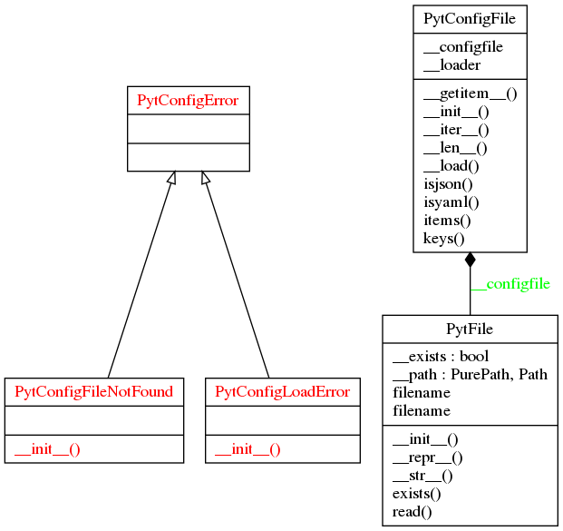

# python-config-file
## Description:

This package loads the configuration values defined in external JSON or
YAML file, not the built-in data structures.

## Setup:

```shell
$ git clone https://github.com/francois-le-ko4la/python-config-file.git
$ cd python-config-file
$ make install
```

## Test:

This module has been tested and validated on Ubuntu.
```shell
$ make test
```

## Use:

```python
from pytconfig import PytConfigFile
conf = "/path/to/the/file"
# PytConfigFile(path (str), PytConfigFile.{isjson|isyaml})
config = PytConfigFile(conf, PytConfigFile.isjson)
print(config['mykey'])
print(config.keys())
print(len(config))
```

## Project Structure
```
.
├── last_check.log
├── LICENSE
├── Makefile
├── pictures
│   ├── classes_pytconfig.png
│   └── packages_pytconfig.png
├── pytconfig
│   ├── __about__.py
│   ├── config.py
│   ├── file.py
│   └── __init__.py
├── README.md
├── requirements.txt
├── runtime.txt
├── setup.cfg
├── setup.py
└── tests
    ├── facebook.json
    ├── facebook.yaml
    ├── test_doctest.py
    └── test_pycodestyle.py
```

## Todo:

- [X] Create the project
- [X] Write code and tests
- [X] Test installation and requirements (setup.py and/or Makefile)
- [X] Test code
- [X] Validate features
- [X] Write Doc/stringdoc
- [X] Run PEP8 validation
- [X] Clean & last check
- [X] Fix global header
- [X] Fix tests
- [X] Fix doc
- [X] Release : 0.1.7
- [X] change (un)install process
- [X] remove MANIFEST.in
- [X] manage global var: __version__....
- [X] improve the doc
- [X] remove old tests
- [X] Release : 0.1.9


## License

This package is distributed under the [GPLv3 license](./LICENSE)

### Runtime

```
python-3.6.x

```
### Requirements

```
setuptools>=36.2.7
pycodestyle>=2.3.1

```
### UML Diagram


### Objects
[PytConfigFile()](#pytconfigfile)<br />
[PytConfigFile.isjson()](#pytconfigfileisjson)<br />
[PytConfigFile.isyaml()](#pytconfigfileisyaml)<br />
[PytConfigFile.keys()](#pytconfigfilekeys)<br />
[PytConfigFile.items()](#pytconfigfileitems)<br />
[PytFile()](#pytfile)<br />
[@Property PytFile.filename](#property-pytfilefilename)<br />
[PytFile.exists()](#pytfileexists)<br />
[PytFile.read()](#pytfileread)<br />

#### PytConfigFile()
```python
class PytConfigFile(dict):
```

```
This Class provides a dict from a JSON File or YAML file.
You can use it to avoid a lot of CONST in your scripts.

Use:
   >>> # pathlib to run the test everywhere
   >>> import pathlib
   >>> path = str(pathlib.Path(__file__).resolve().parent) + "/"
   >>> cur_file = path + '../tests/facebook.jso'
   >>> config = PytConfigFile(cur_file, PytConfigFile.isjson)
   Traceback (most recent call last):
   ...
   OSError: File not found !
   >>> cur_file = path + '../LICENSE'
   >>> config = PytConfigFile(cur_file, PytConfigFile.isjson)
   Traceback (most recent call last):
   ...
   ValueError: Can't load the file...
   >>> cur_file = path + '../tests/facebook.json'
   >>> config = PytConfigFile(cur_file, PytConfigFile.isjson)
   >>> print(config['debug'])
   True
   >>> print(config.keys())
   dict_keys(['description', 'debug', 'data'])
   >>> print(len(config))
   3
   >>> cur_file = path + '../tests/facebook.yaml'
   >>> configyaml = PytConfigFile(cur_file, PytConfigFile.isyaml)
   >>> print(configyaml['debug'])
   True
   >>> print(configyaml.keys())
   dict_keys(['description', 'debug', 'data'])
   >>> print(len(configyaml))
   3
```

##### PytConfigFile.isjson()
```python
@staticmethod
def PytConfigFile.isjson():
```
> <br />
> use it to define the file type<br />
> <br />
##### PytConfigFile.isyaml()
```python
@staticmethod
def PytConfigFile.isyaml():
```
> <br />
> use it to define the file type<br />
> <br />
##### PytConfigFile.keys()
```python

def PytConfigFile.keys(self):
```
> <br />
> None<br />
> <br />
##### PytConfigFile.items()
```python

def PytConfigFile.items(self):
```
> <br />
> None<br />
> <br />
#### PytFile()
```python
class PytFile(object):
```

```
>>> data_file = PytFile("lorem")
Traceback (most recent call last):
...
OSError: File not found !
>>> data_file = PytFile(None)
Traceback (most recent call last):
...
OSError: File not found !
>>> fstab = PytFile("/etc/fstab")
>>> fstab.filename.stem
'fstab'
>>> fstab
/etc/fstab
>>> # pathlib to run the test everywhere
>>> import pathlib
>>> path = str(pathlib.Path(__file__).resolve().parent) + "/"
>>> license = PytFile(path + "../LICENSE")
>>> license.filename.stem
'LICENSE'
>>> license.exists()
True
>>> result = license.read()
>>> result = result.split("\n")
>>> result[0]
'                    GNU GENERAL PUBLIC LICENSE'
```

##### @Property PytFile.filename
```python
@property
def PytFile.filename(self):
```
> <br />
> @Property filename (str): /path/to/the/file<br />
> <br />
##### PytFile.exists()
```python

def PytFile.exists(self):
```
> <br />
> exists (bool): True if the file exists.<br />
> <br />
##### PytFile.read()
```python

def PytFile.read(self):
```
> <br />
> Read the content<br />
> <br />

